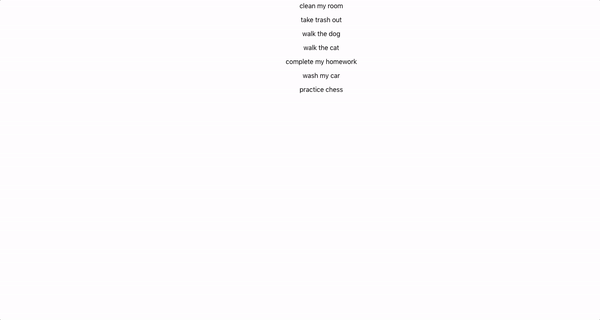

## Conditional Rendering

In Visual Studio code, press `command+shift+v` (Mac) or `ctrl+shift+v` (Windows) to open a Markdown preview.

## Getting Started

Using your command line, you will need to navigate to the this folder, install all dependencies, and start the app.

```bash
cd exercises/03-conditional-rendering/
code . # if you would like to open this in a separate VSCode window
yarn install
yarn start
```

If, at any time, you need to stop the app, press `ctrl+c`.

## Instructions

Before starting, take a look at the file _exercises/03-conditional-rendering/src/data/todos.js_.

1. In the "App" component, import the the "todos". You can find the "todos" inside of the _03-conditional-rendering/src/data/_ folder.
2. Create a component named "Todo". It will accept two different props. The first prop will be named "todos" and it will accept an array of objects. The second prop will take a prop named "showCompleted" and it will accept a boolean.
3. Import the "Todo" component in the "App" component.
4. Pass props from "App" component into the "Todo" component like this:

```xml
<Todo todos={todos} showCompleted={false} />
```
 
5. The "Todo" component should iterate over the todos. If the "showCompleted" is true, it will render the completed items in the todo list. If the "showCompleted" is false, it will render all the todos that have not been completed.


