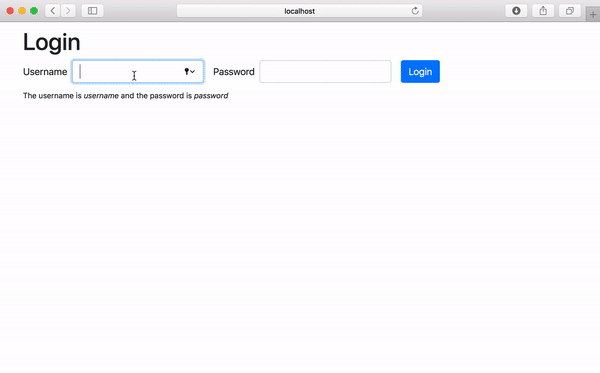

# Authentication Challenge 1

In Visual Studio code, press `command+shift+v` (Mac) or `ctrl+shift+v` (Windows) to open a Markdown preview.

## Reasons for the Challenge

Many application need a user login or signin process of some kind. This challenge will introduce you to JWT token based authentication within a React Single Page Application (SPA).

### Examples and Documentation

See [quick and dirty authentication example](../../examples/12a-authentication-quick-dirty/).

## Getting Started

You will need to have two terminal windows open and running at once. If you are using Visual Studio Code, you can click on the split-screen or plus icon in your terminal panel:


In one terminal window, you will need to run the authentication server. Please follow the _Getting Started_ steps [in this README.md](../../authentication-server/README.md) on how to install and start the authentication server.

In the other terminal window, you will need to navigate to the this folder, install all dependencies, and start this exercise.

```bash
cd exercises/12a-authentication/
code . # if you would like to open this in a separate VSCode window
yarn install
yarn start
```

At any point, if you need to stop the server, press `ctrl+c` .

## User Stories

As a user, I would like to login so that I can see a list of my favorite movies.

As a user, I would like to get feedback when I enter the wrong username or password in the login form.

As a user, I need to be able to logout.



NOTE that instead of users, you will be rendering a list of movies.

## Acceptance Criteria

- After the user submits the login form, you must make an AJAX request to http://localhost:7000/api/login to login the user.
- If the user typed in an invalid username or password, you must display an error message telling them this.
- You will be getting a token from http://localhost:7000/api/login API and you should store it in state.
- Once the user has logged in, they should see a list of movies.
- The user should be able to logout. After they logout, they should return to the login form.

## Instructions

Start with the instructions inside _src/components/App/App.jsx_ first, then move on to _src/components/Home/Home.jsx_.

You will be making AJAX calls to:

- http://localhost:7000/api/login
- http://localhost:7000/api/movies

[Please refer to the server documentation for more information on how to make these request.](../../authentication-server/README.md)

If you would like to use the Axios library, install it with `yarn add axios`. (`create-react-app` doesn't come with the Axios library, so you will need to install it separately.) Alternatively, you can use the browser native Fetch API.
