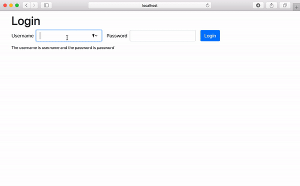

# Authentication Challenge 2 - Routing and Context API

In Visual Studio code, press `command+shift+v` (Mac) or `ctrl+shift+v` (Windows) to open a Markdown preview.

## Reasons for the Challenge

Authentication is important because it enables organizations and businesses to keep their networks secure by permitting only authenticated users to access it's protected resources.

### Examples and Documentation

See [authentication with protected routes and the Context API](../../examples/12b-authentication-routing/README.md).

## Getting Started

You will need to have two terminal windows open and running at once. If you are using Visual Studio Code, you can click on the split-screen or plus icon in your terminal panel:

 resources/authentication-server/two-terminals.png)

In one terminal window, you will need to run the authentication server. Please follow the _Getting Started_ steps [in this README.md](../../authentication-server/README.md) on how to install and start the authentication server.

In the other terminal window, you will need to navigate to the this folder, install all dependencies, and start this exercise.

```bash
cd exercises/12b-authentication/
code . # if you would like to open this in a separate VSCode window
yarn install
yarn start
```

At any point, if you need to stop the server, press `ctrl+c` .

## User Stories

As a user, I would like to login so that I can see a list of my favorite movies.

As a user, I would like to get feedback when I enter the wrong username or password in the login form.

As a user, I need to be able to logout.



NOTE that instead of users, you will be rendering a list of movies.

## Acceptance Criteria

- You must use protected routes. The list of movies is protected content, which means the user must be logged in to see a list of movies.
- After the user submits the login form, you must make an AJAX request to http://localhost:7000/api/login to login the user.
- If the user typed in an invalid username or password, you must display an error message telling them this.
- You should be getting a JWT token from http://localhost:7000/api/login API and setting the token inside of a api and the Context API.
- Once the user has logged in, they should see a list of movies.
- The user should be able to logout. After they logout, they should return to the login form and should be able to see any protected content (the list of movies).
- You will want to take advantage of the Context System to inform other components that a user is logged in.

## Developer Notes

Since we're using cookies as a way to authenticate the user, we will have to take an additional step to protect our content. With every GET request will send the server a JWT token that we received when we are first logged in. That JWT will be sent to the server and used to identify the user. Please see the [server's README.md](../../authentication-server/README.md) file for an example.

## Instructions

You will be making AJAX calls to:

- http://localhost:7000/api/login
- http://localhost:7000/api/movies

[Please refer to the server documentation for more information on how to make these request.](../../resources/authentication-server/README.md)

If you would like to use the Axios library, install it with `yarn add axios`. (`create-react-app` doesn't come with the Axios library, so you will need to install it separately.) Alternatively, you can use the browser native Fetch API.

Complete _src/context/AccessTokenContext.jsx_. The JWT token should be stored inside the Context API here.

Update _src/components/Login/Login.jsx_ so that it gets what it needs from the Context API. (To view it, you will need to go to http://localhost:3000/login). It should make a login request to http://localhost:7000/api/login. If the user successfully logs in, you should store the JWT token returned from in the Context API. You will then to to import `useHistory` and redirect them to the home screen (_/home_). If the user's credentials are not correct, you will need to display an error.

Update _src/components/Home/Home.jsx_ so that it can get the JWT token from the Context API and make a request to display a list of movies.

Create a component called _ProtectedRoute_. (See https://codesandbox.io/s/protected-routes-v52-keg2e). Once it is complete, import and and use the ProtectedRoute inside _src/components/Routing/AppRouter.jsx_.
