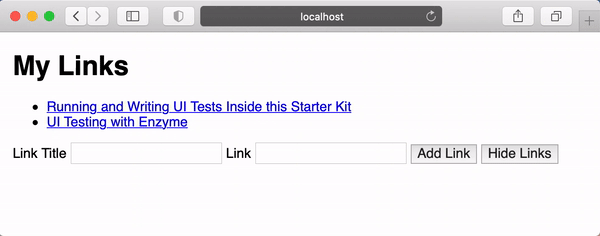

# Automated Testing in React

In Visual Studio code, press `command+shift+v` (Mac) or `ctrl+shift+v` (Windows) to open a Markdown preview.

## Reasons for this Challenge

We write unit tests to catch bugs, make refactoring code easier, and to improve code quality. The purpose of this challenge is to teach you how to react automated unit tests in React.

## Documentation

For this assignment, we will be using the following testing libraries:

- Jest to run the tests, which is [built into create-react-app](https://create-react-app.dev/docs/running-tests/).
- [Enzyme](https://enzymejs.github.io/enzyme/docs/api/) to render React components, and to query and manipulate the DOM outputted from React components.
- [Chai BDD](https://www.chaijs.com/api/bdd/) to assert that your test has passed.

## Getting Started

Using your command line, you will need to navigate to the this folder, install all dependencies.

```shell
cd exercises/13-automated-testing/
code . # if you would like to open this in a separate VSCode window
yarn install
```

With this exercise, you will be writing and running the tests.

```shell
yarn test
```

If the test says "No tests found related to files changed since last commit.", press `a` to run the test.

If, at any time, you need to quit the tests, press `ctrl + c`.

## User Stories

Note that for this assignment, you will not be working on the UI - you will we writing the tests for the UI instead. However, we are including these unit tests to give you context on the application that you are testing. You can, of course, run `yarn start` to demo what this application is doing.



As a user, I would like to create a list of links.

As a user, I would like to add a new link to my list of links.

As a user, I would like to hide my list of links.

## Instructions

Open the file _exercises/13-automated-testing/src/components/App/App.test.js_ and follow its instructions.

## Acceptance Criteria

- All tests - both the tests started for you and the tests you are instructed to write - must pass
- Your tests must not return any false positives

If you completed the assignment, your test output should look like this:

```
 PASS  src/components/App/App.test.js
  <App />
    ✓ should render a heading (5 ms)
    ✓ should render two buttons on the screen (the first is the 'Add Link' button, and the second is the 'Hide Link' button (4 ms)
    ✓ should render two inputs on the screen
    ✓ should render two links (<li>) on the screen when the component first renders (40 ms)
    ✓ should hide the links when the hide button is clicked (8 ms)
    ✓ should add a another link <li> on the screen when the add button is clicked (6 ms)
    ✓ should add the user input to the new link <li> on the screen when the add button is clicked (9 ms)

Test Suites: 1 passed, 1 total
Tests:       7 passed, 7 total
Snapshots:   0 total
Time:        3.414 s
```
