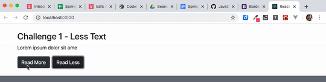
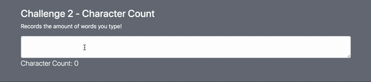

# React Component Class - State Challenges

In Visual Studio code, press `command+shift+v` (Mac) or `ctrl+shift+v` (Windows) to open a Markdown preview.

## Reason for the Challenges

When you join a team of developers, you are often hired to maintain an already established codebase. In many cases, it takes too much time to refactor and entire codebase with the latest features, so you will be inheriting older styles of writing code. One of the older features of React is the that you may need to know is the Component class. It is the predecessor to hooks (e.g. `useState`). Its purpose was to break your code into components and manage state.

## Getting Started

Using your command line, you will need to navigate to the this folder, install all dependencies, and start the app.

```bash
cd exercises/15-component-class/
code . # if you would like to open this in a separate VSCode window
yarn install
yarn start
```

If, at any time, you need to stop the app, press `ctrl+c`.

## Challenge 1

Create a like button.


### Instructions

Import and display your "Likes" class component inside of _src/App.jsx_.

Complete the instructions inside of _src/components/Likes/Likes.jsx_.

### Acceptance Criteria

- You must set state correctly with `setState`.
- When the user clicks on the "Like" button, it should increase the number of likes.

## Challenge 2

Create buttons that will expand and truncate text.



### Instructions:

Create a class component named "LessText" and it will accept two props. The first prop will be named "text" and it will accept a string. The second prop will be named "maxLength" and it will accept an integer.

Import and display your "LessText" class component inside of _src/App.jsx_.

Create "Read More" and "Read Less" buttons inside of "LessText", which will toggle text based on the "maxLength".

### Acceptance Criteria

- The "LessText" component must extend the React Component class.
- You must set state correctly with `setState`.
- The "LessText" class component will have two buttons: the first button will say "Read More" and the second button will say "Read Less".
- The "Read More" button will display the entire text.
- The "Read Less" button will truncate the set by the "maxLength" prop.

## Challenge 3

Count the number of character that a user types within a textbox.



### Instructions:

Create a class component named "CharacterCount". (It will not require any props.)

Import and display your "CharacterCount" component inside of _src/App.jsx_.

"CharacterCount" will render a `<textarea>` textbox that will capture user input. It will then render count of the number of characters in the textbox on the screen.

### Acceptance Criteria

- The "CharacterCount" component must extend the React Component class.
- You must set state correctly with `setState`.
- The "CharacterCount" component will display the number of characters that the user has typed within the `<textarea>` on the screen.
