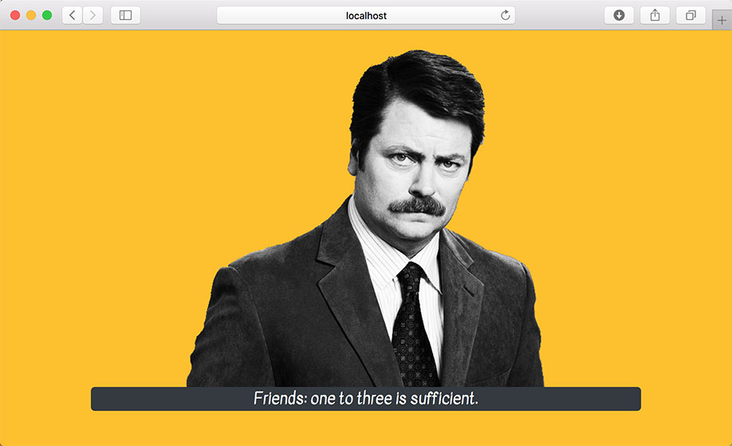

# React Component Class - Lifecycle Hooks

In Visual Studio code, press `command+shift+v` (Mac) or `ctrl+shift+v` (Windows) to open a Markdown preview.

## Reason for the Challenge

If you join a team that has an older React code base, you may need to know how to make AJAX requests within React's Component class. To perform AJAX requests and other asynchronous functionality, you will need to leverage a feature of the Component class called lifecycle hooks. Lifecycle hooks are comparable to the `useEffect` hook.

## Getting Started

Using your command line, you will need to navigate to the this folder, install all dependencies, and start the app.

```bash
cd exercises/16-lifecycle-hooks/
code . # if you would like to open this in a separate VSCode window
yarn install
yarn start
```

If, at any time, you need to stop the app, press `ctrl+c`.

## User Stories

As a user, I want to see a Ron Swanson quote immediately on my screen.

As a user, I want to see feedback if the quote is loading or if there is an error.



## Acceptant Criteria

- You should convert the function into a class component.
- The application should make AJAX request to the _Ron Swanson Quote_ inside the _componentDidMount_ life cycle hook.
- It should display a Ron Swanson quote on the screen.
- It should display some kind of loading message or feedback when an AJAX request is loading.
- It should display an error message if there as error making the AJAX request.
- It should use _setState_ and the _componentDidMount_ life cycle hook.

## Instructions

Before doing this exercise, read the documentation for the [Ron Swanson Quotes API](https://github.com/jamesseanwright/ron-swanson-quotes).

If you would like to use the Axios library, install it with `yarn add axios`. (`create-react-app` doesn't come with the Axios library, so you will need to install it separately.) Alternatively, you can use the browser native Fetch API.

Complete the instructions in [App.jsx](src/App.jsx).
